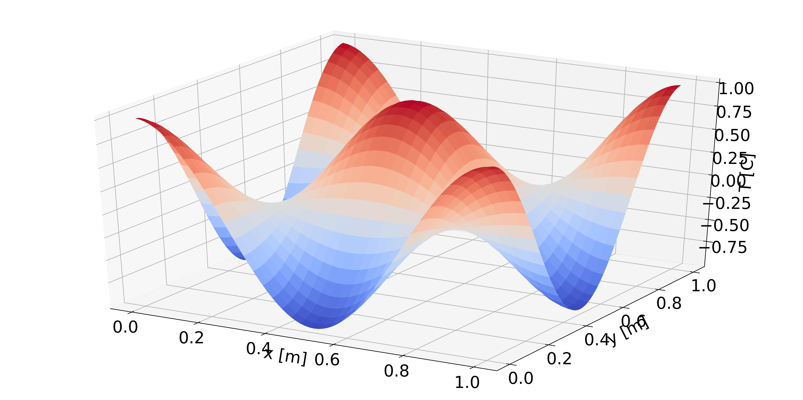
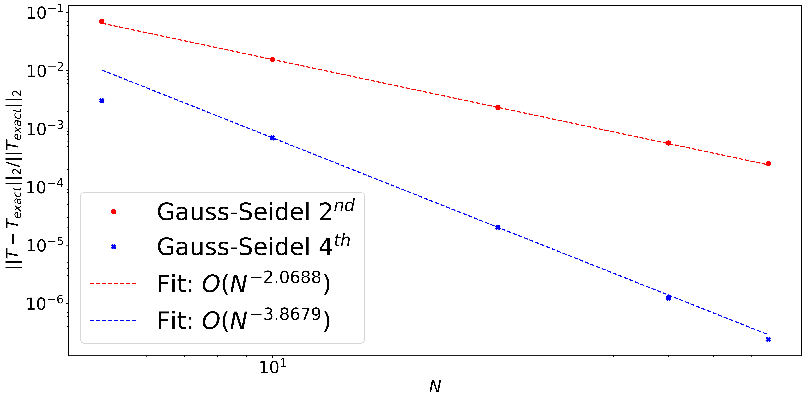

# Tools and Techniques in Computational Science

## Author
- Mohammad Afzal Shadab (mashadab@utexas.edu)

## Affiliation
Oden Institute for Computational Engineering and Sciences / Jackson School of Geosciences / University of Texas Institute for Geophysics
The University of Texas at Austin

## 2-line Summary
This repository has codes from Tools and Techniques in Computational Science course. These codes have been validated against the reference.

# Skills required / learnt
1. C++ 
2. Linux / Unix
3. Bash scripting
4. Version control (Git)
5. Stampede2 job launching
6. Portable, Extensible Toolkit for Scientific Computation (PETSc) 
7. GRVY (Toolkit library for supporting high-performance, scientific applications)
8. Manufactured Analytical Solution Abstraction (MASA)
9. Bash automated testing system (bats)
10. Travis CI
11. Docker

## Project: Solving the heat equation using high order methods on Stampede2 Supercomputer at Texas Advanced Computing Center ([Report](), [YouTube video](https://www.youtube.com/watch?v=I4WwXOMeBo4&t=1s))
In this project, I performed testing mainly verification, regression, and runtime performance. I have also used these libraries: GRVY for timekeeping and debugging, MASA for method of manufactured solutions, bash automated testing system (bats) for designing regression tests. Finally, I have shown some results and compared them with analytical results. Moreover, I added code coverage using gcov, output file formatting using Hierarchical Data Formatting (HDF5), Portable Extensible Toolkit for Scientific Computation (PETSc) library with GMRES solver integration and finally performed the continuous integration using Travis.

Figure : Top - Solving the 2D heat equation. Bottom - Convergence plots using second and fourth order schemes

### Quick Usage
Refer to the solution PDFs find description of the bash scripts or C++ codes.

## Acknowledgement
I would like to acknowledge Professor Karl Schulz for teaching the course in 2020.
